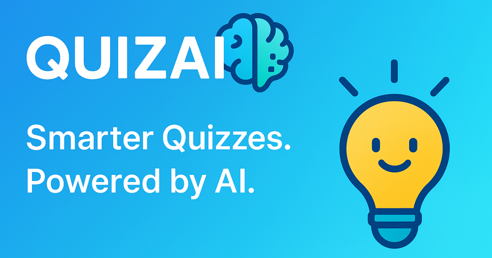

# QUIZAI - Test Your Knowledge with AI

Create personalized quizzes instantly with **QuizAI**. Pick a topic and get 10 AI-generated questions to test your knowledge.

Currently supported models:

- Gemini 2.5 flash

---

## Installation

Requirements:

- Node.js
https://nodejs.org/en/download/current

## Development server

To start (and watch) the development application, run `npm start` and go to http://localhost:8080

## Production build

Run `npm run build`

Bundled application is located inside `dist` folder. Entry point is `index.html`.

## Development tooling

- `npm run prettier` to enforce coding style and format
- `npm run typescript` to check types errors
- `npm run xo` to run code linter

## Author

Gautier Jousset
@Lyeed
https://lyeed.github.io/
